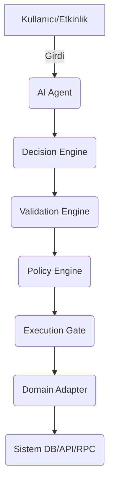

# Özet (Executive Summary)

Bu rapor, mevcut meta-framework taslağınızı **domain’den bağımsız, taşınabilir ve üretime hazır** bir yapıya dönüştürmek için kapsamlı teknik öneriler ve bir master eylem planı sunmaktadır. Mevcut mimarinin (karar motoru, doğrulama, politika ve uygulama katmanları vb.) zayıf noktaları detaylıca incelenmiş; endüstri örnekleri ve açık kaynak projeler ışığında iyileştirmeler önerilmiştir. Örneğin, Praetorian’ın sunmuş olduğu AI koordine platformu mimarisinde, doğrusal bir iş akışı içinde katmanlar arası “kontrol kancaları” (hooks) ile kararlı ve deterministik davranış sağlanması hedeflenmiştir【7†L180-L189】. Benzer şekilde, Osprey gibi açık çerçeveler de *planlı yürütme*, *kontrol edilebilir altyapı* ve *kontrol noktaları (checkpoint)* kullanarak ölçeklenebilirliği ve güvenliği ön planda tutar【2†L34-L43】. 

Bu belgede, sistemin **güvenlik**, **hata toleransı**, **idempotency**, **yarış durumu**, **performans/ölçeklenebilirlik**, **gecikme süreleri** gibi teknik zayıflıkları ele alacağız. Ardından, *Decision Engine*, *Validation Engine*, *Policy Engine*, *Execution Gate*, *Domain Adapter*, *Session Protocol*, *Observability* ve *Simulation Mode* bileşenlerinin geliştirilmesine yönelik tasarım önerileri ve örnek mimari diyagramları (Mermaid akış/ER) sunacağız. JSON şemaları, karar paketleri, API sözleşmeleri ve TypeScript tip tanımları tablo halinde gösterilecektir. 

Güvenlik açısından **RBAC/ABAC tabanlı erişim kontrolü**, **girilen/verilen verilerin doğrulanması**, **şifreleme** ve **audit log** altyapısı vurgulanacaktır (örneğin Susan Das’ın önerdiği şekilde fine-grained ABAC/RBAC ve imzalı olay kayıtları)【48†L157-L164】. Test stratejileri olarak birim, entegrasyon ve simülasyon modları ele alınacak, CI/CD, containerization ve çoklu-cloud taşınabilirlik için öneriler sunulacaktır. Son olarak, revizyon süreci için **Master Eylem Planı** (adım adım, zaman çizelgesi, sorumlular, iş gücü tahmini, riskler) tablo halinde verilmiştir. Bütün öneriler güncel endüstri kaynakları, akademik yayınlar ve açık kaynak örnekleri ile desteklenmiştir (örn. Osprey【2†L34-L43】, Praetorian【7†L180-L189】, OpenAI Agents SDK【27†L733-L741】, OWASP AI Güvenlik CheatSheet【30†L203-L211】【32†L543-L549】, vb.).

# 1. Teknik Mimari Zayıflık Analizi

Meta-framework’ünüzün mevcut taslağı, AI temelli karar önerileri ile sistem uygulamasını ayırarak güvenliği ve kontrolleri iyileştirmeyi amaçlamaktadır. Ancak aşağıdaki teknik zayıflık ve risklere dikkat edilmelidir:

- **Güvenlik ve Saldırı Yüzeyi:** Yapıda AI kararları doğrudan sistem üzerinde işlem yaptırmadan önce doğrulandığı belirtilse de, hala *prompt injection* veya *veri manipülasyonu* riski bulunmaktadır. Kullanıcı girdilerine veya dış kaynaklı verilere dayalı kararlar, kötü niyetli içerik üretebilir. OWASP’a göre AI ajanları en çok “Prompt Injection” gibi saldırılara açıktır【30†L203-L211】. Ayrıca, *araç suiistimali* (tool abuse) riskine karşı her aracın izinlerini sınırlandırmak gerekir【30†L235-L242】. Politika motoru açık bırakılırsa veya yanlış yapılandırılırsa yetkisiz işlemler yapılabilir. 

- **Veri Güvenliği ve Gizlilik:** Karar hattı boyunca ele alınan payloadlar ve context verileri hassas olabilir. Görevlerin kaydı ve eylemlerin denetlenmesi için audit log tutulsa da, bu logların gizliliği korunmalıdır. GDPR/AI Yasası gibi yönetmelikler doğrultusunda, yüksek riskli sistemlerde **tüm önemli olayların** otomatik kaydı (logging) zorunludur【41†L476-L484】. Uygulama veritabanında gizli/veri tabanlı işlemlerin şifrelenmesi ve sadece yetkili rollerin erişebilmesi (RBAC/ABAC) sağlanmalıdır【48†L157-L164】. 

- **Hata Toleransı ve Yedeklilik:** Mevcut taslakta tekil bir *Re-try* veya yedek mekanizma belirtilmemiş. İş akışının bir aşamasında hata oluştuğunda (örneğin *Domain Adapter* içindeki bir API çağrısı başarısız olduğunda), işlem durmalı ya da otomatik yeniden denenmelidir. *İdempotency* eksikliği, tekrar denemelerde aynı eylemin iki defa uygulanmasına yol açabilir. Örneğin, “para çekme” gibi bir finansal işlem iki kez uygulanırsa sistem tutarsız hale gelir. Bu nedenle tüm kritik eylemlerin idempotent olması veya *de-duplication token* kullanılarak tekrarlı yürütmenin etkisinin sıfırlanması gerekir. Praetorian platformu da benzer şekilde “doğrulama döngüleri” ile işlem bütünlüğü sağlamaya çalışmaktadır【7†L180-L189】.

- **Çalışma Zamanı Yarışmaları (Race Conditions):** Çoklu paralel isteklerde (örneğin eş zamanlı kullanıcı oturumlarında) kaynaklara erişim kontrolü sağlanmamışsa yarışma durumları oluşabilir. Özellikle *Execution Gate* bölümünden geçip aynı anda birden fazla işleme başlanırsa, *domain adapter* katmanında veritabanı güncellemeleri birbirini geçebilir. Distributed locking (dağıtık kilitleme) veya tek bir kere başarıyla tamamlanan işlemlerin tekilleştirilmesi (idempotent token) yöntemleri kullanılmalıdır. Praetorian’ın tavsiyesi üzere *kritik işlemler deterministik olarak denetlenmeli*, kod dışı ortamlarda “kalıcı bellek” ve kilit sistemleri kullanılmalıdır【47†L25-L33】【47†L61-L69】.

- **Performans ve Ölçeklenebilirlik:** Mevcut tasarımda model çağrıları, karar motoru ve policy kontroller tekil bir zincirde öngörülmüş. Bununla birlikte, gerçek dünyada istek trafiğine bağlı olarak gecikme (latency) ve throughput sorunları yaşanabilir. Özellikle büyük hacimli işlemlerde model API çağrıları (GPT-4 gibi) ve veri tabanı I/O’ları darboğaz oluşturur. Örneğin, Praetorian çalışmalarında token tüketiminin **performans varyansının %80’ini** açıkladığı tespit edilmiştir【7†L198-L205】. Bu yüzden basit görevleri hafif modellerle, karmaşıkları daha güçlü modellerle gerçekleştirme (model rota politikası) önerilir【48†L179-L187】. Ayrıca, *karar motoru* ile *doğrulama/policy* katmanları ayrı konteynerlerde ölçeklenebilir şekilde tasarlanmalıdır. Görev kuyruğu ve yük dengeleme (yüksek bekleyen iş için kuyruk/dead-letter queue) mekanizmaları kurulmalıdır (Susan Das’ın platform önerisinde olduğu gibi)【48†L174-L184】. 

- **Gözlemlenebilirlik ve İzlenebilirlik Eksiklikleri:** Şu anda kararlarda loglama yapıldığından bahsedilmemiş. Hata ayıklama, performans analizi ve uyumluluk denetimleri için tüm *decision* paketlerinin, policy sonuçlarının ve uygulama adımlarının kaydı tutulmalıdır. OWASP da *“tüm ajan kararları, araç çağrıları ve sonuçlar loglanmalı”* demektedir【32†L543-L549】. Loglarda gizli bilgilerinin maskelenmesi (redact) unutulmamalıdır. Ayrıca, geçmiş kararları **replay** edebilme kabiliyeti için, sisteme gelen girdiler ve AI çıktıları versionlı olarak saklanmalıdır.

- **Teknoloji Belirsizlikleri:** Belgede belirtildiği üzere hedef trafik, ölçek gereksinimleri ve tercih edilecek programlama dili henüz net değil. Bu belirsizlikler, mimari seçimleri ve performans hedeflerini etkiler. Örneğin küçük/orta ölçek bir senaryoda basit REST hizmetleri yeterli olabilirken, büyük ölçek için microservice mimarisi ve küme mimarisi gerekir. Bu belirsizlikler göz önüne alınarak, esnek ve genişleyebilir bir çözüm önerilmelidir.

Özetle, mimarinin zayıf noktaları arasında **yalnızca AI çıkışına bağımlılık**, **kritik işlemlerde doğrudan uygulamaya geçiş eksikliği**, **yeterli kontrollerin atlanması** (örn. RBAC/ABAC olmadan yetki kontrolü) ve **loglama-test mekanizmalarının eksikliği** öne çıkmaktadır. Yukarıdaki sorunlara yönelik öneriler sonraki bölümlerde detaylandırılacaktır.

# 2. Tasarım İyileştirmeleri ve Mimari Şemaları

Aşağıdaki iyileştirmeler, **domain’den bağımsız**, **kontrollü** ve **taşınabilir** bir meta-framework oluşturmak için önerilmektedir. Genel akış şu şekildedir:



【20†embed_image】 *Şekil:* AI ajanları için katmanlı yürütme mimarisi örneği (Praetorian’ın referans çizimi). Kararlar, bir karar motorunda oluşturulup *doğrulama* ve *politika* katmanlarından geçerek *uygulama geçidine* yönlendirilir【7†L180-L189】【48†L157-L164】.

## 2.1 Karar Motoru (Decision Engine)

- **Giriş/Çıkış (Intent) Şeması:** Karar Motoru, AI’dan gelen ham çıktıyı standart bir JSON karar paketine dönüştürmelidir. Önerilen format şunları içerir (örn. TypeScript tipi): 

  ```typescript
  interface Decision {
    intent: string;          // Ör: "EXECUTE_ACTION"
    category: string;        // Ör: "FINANCIAL"
    payload: object;         // Domain bağımsız veriler
    context: object;         // Kullanıcı/oturum bilgisindeki ek veriler
    risk_level: "LOW"|"MEDIUM"|"HIGH"; 
    metadata: {
      source: string;       // "AI" gibi
      timestamp: string;    // Zaman damgası
      session_id: string;   // Oturum kimliği
    }
  }
  ```
  
  Bu yapı, AI çıktısının **parse edilebilir ve kontrol edilebilir** olmasını sağlar. SQL/JSON şeması örneği aşağıdaki gibidir:

  | Alan         | Tip     | Açıklama                            |
  |--------------|---------|------------------------------------|
  | intent       | string  | Soyut eylem niyeti (domain-agnostic) |
  | category     | string  | Davranış tipi (`SAFE`, `FINANCIAL` vb.) |
  | payload      | object  | Eylem verileri (isteğe bağlı alt-sözlük) |
  | context      | object  | Oturum ve kullanıcı bağlam bilgileri |
  | risk_level   | enum    | `LOW|MEDIUM|HIGH` (sistem tarafından atanabilir) |
  | metadata     | object  | Kaynak, zaman vb. (sayısal veriler)  |

- **Niyet Sınıflandırma:** Intent seti öngörüldüğü gibi sade tutulmalı (örn. `READ_DATA`, `WRITE_DATA`, `EXECUTE_ACTION`, `MODIFY_STATE` vb.). Bu değerler domain’den bağımsız kavramlardır. AI modeli, ham metin çıktısını bu intentlerden birine çevirmelidir. Bunun için yaygın yöntem, AI’dan gelen JSON’u doğrudan bir şema kütüphanesi (Zod, JSON Schema) ile doğrulamaktır.

- **Hata Kontrolleri:** JSON şeması ile zorunlu alanlar kontrol edilmeli, ek gelen alanlara (örn. injection amaçlı) izin verilmemelidir. Örneğin Zod ile giren nesne şu şekilde doğrulanabilir【8†L25-L30】【48†L157-L164】:

  ```typescript
  const DecisionSchema = z.object({
    intent: z.string(),
    category: z.string(),
    payload: z.record(z.any()).optional(),
    context: z.record(z.any()).optional(),
    risk_level: z.enum(["LOW","MEDIUM","HIGH"]),
    metadata: z.object({
      source: z.string(),
      timestamp: z.string().datetime(),
      session_id: z.string()
    })
  });
  ```
  
- **Örnek Karar Paketi:** AI’dan gelen bir örnek karar şöyle görünebilir:
  ```json
  {
    "intent": "EXECUTE_ACTION",
    "category": "FINANCIAL",
    "payload": { "value": 100, "destination": "account123" },
    "context": { "user_id": 42, "role": "trader" },
    "risk_level": "MEDIUM",
    "metadata": { "source": "AI", "timestamp": "2026-04-30T06:00:00Z", "session_id": "sess-xyz" }
  }
  ```

## 2.2 Doğrulama Katmanı (Validation Engine)

- **Amaç:** Karar yapısının şema ve iş mantığı açısından geçerliliğini sağlamak. Aşağıdaki adımlar uygulanır:
  1. **JSON Şeması Doğrulaması:** Karar nesnesi yukarıdaki JSON şemaya uyuyor mu? Gerekli alanlar varsa eksik mi? Yanlış tipte değer var mı? Bu aşamada eksik/yanlış bilgi `INVALID_SCHEMA` hatası ile reddedilir.
  2. **Tip & Format Kontrolleri:** Örneğin `timestamp` alanının ISO tarih formatında olması, `risk_level` değerinin önceden tanımlı bir enum’da olması gibi kontroller yapılır.
  3. **Bağlam Doğrulaması:** İlgili `session_id` ve `user_id` var mı? Oturum ve kullanıcı geçerli mi? Gerekirse kimlik doğrulama/kullanıcı doğrulama yapılmalıdır.
  
  Doğrulama başarısız olursa aşağıdaki biçimde reddetme cevabı döndürülür: 
  ```json
  { "status": "REJECTED", "reason": "INVALID_SCHEMA" }
  ```

- **Kesin Durum:** Tüm kontrol katmanları geçilmediği sürece işleme devam edilmez. Örneğin zorunlu bir `intent` alanı eksikse işlem durur. Bu sayede *Malformed input* saldırıları engellenmiş olur【30†L203-L211】【48†L157-L164】.

## 2.3 Politika Katmanı (Policy Engine)

- **Amaç:** Sadece izin verilmeyen değil, özellikle *sistemde tanımlanmış izinlere uygun* eylemleri seçmek. Örneğin bir finansal işlem isteğinde kullanıcının yeterli yetkisi yoksa işlem reddedilmelidir. Sade if-else’ler veya kurallar motorları kullanılabilir. 
- **Örnek Kurallar:**
  - Roller (RBAC) ve izni kontrolleri: Kullanıcının `role` veya `attribute` değerine göre karar verilir【48†L157-L164】. Örneğin:
    ```typescript
    if (decision.category === "FINANCIAL" && user.role !== "authorized_finance") {
      throw new Error("UNAUTHORIZED");
    }
    ```
  - İş kuralları: İş mantığına göre ek şartlar kontrol edilir (örneğin günlük limitler, işlem sayısı sınırları).
  - Risk değerlendirmesi: `risk_level` HIGH ise ek onay şartı eklenebilir.
  
- **ABAC/RBAC:** Susan Das’ın önerisine göre, politika motoru **ince taneli ABAC/RBAC** ile tasarlanmalıdır【48†L157-L164】. Yani sadece kullanıcının rolüne değil, aynı zamanda veri/işlem özelliklerine göre de izinler belirlenir. Örneğin GDPR kapsamındaki verileri işleyen kararlar için ekstra onay adımı (Permission Check) eklenebilir.

- **Kapsamlı Denetim (Audit):** Tüm izin verme/red etme kararları loglanmalıdır. Bu sayede (ve gereklilik olarak EU AI Act’a göre) **geçmiş kararların nasıl alındığı** izlenebilir【41†L476-L484】【48†L157-L164】. 

## 2.4 Yürütme Geçidi (Execution Gate)

- **Amaç:** **Nihai karar noktası**dır. Karar yapısal olarak geçerli ve politikalardan geçmişse gerçek etki uygulanır, değilse reddedilir. 
  ```typescript
  if (validationPassed && policyPassed) {
    executeDecision(decision);
  } else {
    rejectDecision(decision);
  }
  ```
- **İdempotentlik ve Güvenlik:** Bu katmanın işlem tutarlı olması çok kritiktir. Uygulama eylemleri (ör. veritabanı güncelleme) idempotent olmalı ve **yalnızca bir kez** uygulanmalıdır. Örneğin, finansal transferlerde aynı işlem kimliğinin yeniden kullanılmasını engellemek için *empotency token* kullanılabilir. Başarısız tekrar denemelerde aynı çıktı üretilmediğinden (duruma göre hata/fail) emin olunmalıdır. Ayrıca, *yarış durumlarına* karşı kilit mekanizmaları veya kuyruk sistemleri (dead-letter queue, retry pattern) eklenmelidir【48†L174-L184】【32†L543-L549】. 

- **Özellikler:** Bu katmanda her işlem ayrıntılı loglanmalı, gerekirse geri alınabilir (rollback) ve tekrar oynatılabilir olmalıdır. Başarısız bir eylem durumunda uygun geri dönüş ve bildirim mekanizmaları kurulmalıdır (örn. tanımlı hata kodları ve retry stratejileri: gecikmeli retry, max deneme sayısı).

## 2.5 Domain Adaptörü (Domain Adapter)

- **Amaç:** Generic intent’leri (karar paketlerini) uygulamaya özgü eylemlere çevirir. Bu katman domain ile ilgili tüm detayları içerir. Framework’un domain bilgisinden tamamen soyut kalması kritiktir. 
- **Örnek:** 
  ```typescript
  function domainAdapter(decision: Decision) {
    switch(decision.intent) {
      case "READ_DATA":
        return dataService.read(decision.payload);
      case "WRITE_DATA":
        return dataService.write(decision.payload);
      case "EXECUTE_ACTION":
        return actionService.perform(decision.payload);
      // vb.
    }
  }
  ```
- **Bağlantı Protokolleri:** Burada, hedef sistem (veritabanı, servis API, RPC çağrısı vb.) ile iletişim kurulur. Uygulamanın sunucusu veya mikroservislerine yapılan HTTP/RPC çağrıları bu katmanda toplanır. Tüm dışa bağlılıklar (API anahtarları, oturum kimlikleri) burada yönlendirilir.

- **Devre Dışı Bırakma (Simulation Mode):** Bu adaptör, “simülasyon modu” aktifse gerçek çalıştırma yapmayacak şekilde kurgulanmalıdır. Örneğin:
  ```typescript
  if (simulationMode) {
    console.log("Simulate action:", decision.intent, decision.payload);
    return { status: "SIMULATED" };
  } else {
    return actualDomainCall(decision.payload);
  }
  ```
  Böylece gerçek sistemi etkilemeden politika ve doğrulama test edilebilir.

## 2.6 Session Protokolü

- **Amaç:** AI ajanının kararlarını belirli bir çerçeveyle sınırlar ve *drift* olayını önler. 
- **Kurallar:** Karar verirken eksik veri olmamalıdır; aksiyonlar her adımda oturum bilgisiyle ilişkilendirilir. 
- **Tekrar Enjeksiyon:** Daha önce oluşturulmuş karar/cevaplar, oturum boyunca gerektiğinde yeniden kullanılabilir. Böylece bağlam kopması engellenir. 
- **Zaman Aşımı:** Uzun süren AI sorguları için zaman aşımı ayarlanmalı; takılan istekler iptal edilmeli.

## 2.7 Gözlemlenebilirlik (Observability)

- **Karar ve Olay Günlükleri:** Her karar, doğrulama sonucu, politika kararı ve uygulama sonucu loglanmalıdır. Örneğin OWASP’nın önerdiği gibi “tüm ajan kararları, araç çağrıları ve sonuçlar loglanmalı”【32†L543-L549】. Loglar yapılandırılmış (JSON) formatta tutulup bir merkezi log sistemine (ELK, Splunk vb.) gönderilmelidir.
- **İzleme:** *Golden Signal* metriği olarak gecikme, hata oranı, işlem sayısı izlenmelidir【48†L168-L176】. Beklenmeyen anormalliklerde alarm oluşturulmalıdır (örn. topu teklifler).
- **Audit ve Replay:** Toplanan günlükler, özellikle mali ve kritik işlemler için denetim amaçlı saklanmalıdır. Ayrıca geçmiş bir karar paketinin yeniden çalıştırılarak test edilmesi mümkün olmalıdır (replay mekaniği)【48†L168-L176】. 

## 2.8 Simülasyon Modu ve Test

- **Amaç:** Sistemi gerçek etki olmadan test etmek. *Simülasyon modunda*, Execution Gate kapalı tutulur; ancak Validation ve Policy kontrolleri çalıştırılır. Böylece AI çıktılarının sistem üzerinde ne kadar olumlu/olumsuz etkiye yol açacağı önceden değerlendirilebilir.
- **Kullanım Örneği:** Yeni bir politika kuralı ekledikten sonra, simülasyon modunda geçmiş kararlar üzerinden test edilir. Ya da yeni geliştirilmiş Decision Engine, gerçek kullanıcı yerine kaydedilmiş senaryolarla kontrol edilir.
- **Test Senaryoları:** Birim testlerde her bileşen (Decision Engine şema doğrulayıcı, Policy kontrolleri vb.) izole edilerek sınanmalıdır. Entegrasyon testlerinde *domain adapter* sahte servislere (mock) bağlanırken, *CI/CD* pipeline’ında simülasyon modlu testler otomatikleştirilmelidir.

# 3. Veri Modelleri, JSON Şemalar ve API Sözleşmeleri

## 3.1 Karar (Decision) Veri Modeli

Aşağıda, karar paketleri için önerilen JSON şema örneği ve karşılık gelen TypeScript tipi verilmiştir:

| Öğe       | Tip        | Açıklama                                   |
|-----------|------------|-------------------------------------------|
| intent    | string     | Eylem niyeti (domain’den bağımsız etikettir) |
| category  | string     | Davranış tipi (`SAFE`, `FINANCIAL`, `CRITICAL` vb.) |
| payload   | object     | Nitelikli veri (domain’a özel içerik)      |
| context   | object     | Oturum/kullanıcı bağlam bilgisi           |
| risk_level| enum       | `"LOW"|"MEDIUM"|"HIGH"` (sistem belirler)   |
| metadata  | object     | Kaynak, zaman damgası, oturum bilgisi      |
 
```json
{
  "type": "object",
  "properties": {
    "intent":    { "type": "string" },
    "category":  { "type": "string" },
    "payload":   { "type": "object" },
    "context":   { "type": "object" },
    "risk_level":{ "type": "string", "enum": ["LOW","MEDIUM","HIGH"] },
    "metadata": {
      "type": "object",
      "properties": {
        "source":     { "type": "string" },
        "timestamp":  { "type": "string", "format": "date-time" },
        "session_id": { "type": "string" }
      },
      "required": ["source","timestamp","session_id"]
    }
  },
  "required": ["intent","category","risk_level","metadata"]
}
```

## 3.2 Karar Paket Örneği

| Alan       | Örnek Değer                                 |
|------------|---------------------------------------------|
| intent     | `"EXECUTE_ACTION"`                          |
| category   | `"FINANCIAL"`                               |
| payload    | `{ "amount": 500, "account": "AC123" }`     |
| context    | `{ "user_id": 42, "permissions": [...] }`   |
| risk_level | `"HIGH"`                                    |
| metadata   | `{ "source":"AI", "timestamp":"2026-04-30T06:30:00Z", "session_id":"sess-001" }` |

```json
{
  "intent": "EXECUTE_ACTION",
  "category": "FINANCIAL",
  "payload": { "amount": 500, "account": "AC123" },
  "context": { "user_id": 42, "permissions": ["trade"] },
  "risk_level": "HIGH",
  "metadata": { "source": "AI", "timestamp": "2026-04-30T06:30:00Z", "session_id": "sess-001" }
}
```

## 3.3 API Sözleşmeleri

Aşağıda önemli bileşenler için REST benzeri API örnekleri gösterilmiştir:

| Endpoint                  | Yöntem | İstek (Request)                                   | Yanıt (Response)                       | Hata Kodları                  |
|---------------------------|--------|---------------------------------------------------|----------------------------------------|-------------------------------|
| `/decisions/validate`     | POST   | Karar paketi JSON                                  | `{ status: "OK" }` veya hata mesajı    | 400 (geçersiz JSON), 422 (schema) |
| `/decisions/execute`      | POST   | Karar paketi (özgün)                              | `{ status: "EXECUTED", result: {...} }` | 401, 403, 409 (idempotency hatası)  |
| `/domain/action`          | POST   | Arkaplanda domain eylemi (payload ile)            | `{ status: "SUCCESS", details: {...} }` | 500 (sunucu hatası), 503 (servis yok) |
| `/observability/log`      | POST   | `{ eventType, details }` formatında güvenlik logu | `{ status: "LOGGED" }`                 | 400 (geçersiz kayıt formatı)  |

Örneğin `/decisions/execute` isteğinde:
- Başarılı yürütme: `{ status: "EXECUTED", result: { ... } }` dönülür.
- Yetkisiz: `{ status: "REJECTED", reason: "UNAUTHORIZED" }`.
- İdempotent retry: `{ status: "REJECTED", reason: "DUPLICATE_REQUEST" }`.

**TypeScript Tipleri (Örnek):**

```typescript
type Decision = {
  intent: string;
  category: string;
  payload?: Record<string, any>;
  context?: Record<string, any>;
  risk_level: "LOW"|"MEDIUM"|"HIGH";
  metadata: { source: string; timestamp: string; session_id: string; }
};

interface ValidationResponse {
  status: "OK"|"REJECTED";
  reason?: string;
}

interface ExecutionResponse {
  status: "EXECUTED"|"REJECTED"|"SIMULATED";
  result?: any;
  reason?: string;
}
```

# 4. Güvenlik ve Test Planı

## 4.1 Güvenlik Modeli

- **Saldırı Yüzeyi ve Azaltma:** Prompt injection’a karşı, tüm AI girdileri sanitize edilmeli (örn. potansiyel kötü eklemelere filtre). Eksik/başarısız işlemler **Asla** AI tarafında otomatize edilmemelidir (kritik kural: *AI hiçbir zaman doğrudan sistemi çalıştırmaz*). Araçları (MCP araçları) en küçük izinlerle vererek aşırı yetkilendirmeyi önleyin【30†L235-L242】. Örneğin `execute_command` gibi tehlikeli araç izinleri açık olmamalıdır. 

- **Erişim Kontrolü (RBAC/ABAC):** Kullanıcı ve ajan rolleri kesin tanımlanmalı. Susan Das’ın önerdiği gibi, **ince taneli ABAC/RBAC** politikaları uygulayın【48†L157-L164】. Örneğin, sadece belirli rollerin finansal işlemler yapmasına izin verin ve verinin niteliğine göre ek onay katmanları ekleyin. 

- **Şifreleme & Gizlilik:** Tüm iletişim kanalları TLS ile korunmalı【48†L210-L213】. Veritabanında hassas bilgiler şifrelenmiş olarak tutulmalı. Çıktılarda ve loglarda PII içeriyorsa kırpma (redaction) yapılmalı. Özellikle kişisel veri içeren *context* nesneleri gereksiz yere taşınmamalı. 

- **Süreç İzolasyonu:** Ajanın kodunun kapalı bir kabukta (örneğin konteyner/sandbox) çalıştığını varsayılır, ancak ek izolasyon önerilir. Native işletim sistemi düzeyinde (systemd gibi) çalışan *Reaper Daemon* kalıntı süreçleri temizler【18†L129-L134】. Ek olarak, çoklu ajan/süreç ortamlarında, ajanlar arasında güven sınırları çizilmeli (örn. güvenlik seviyelerine göre iletişim sınırlandırması)【32†L667-L674】.

- **Güvenlik Denetimleri:** OWASP AI güvenlik kılavuzu uyarınca tüm önemli etkinlikler loglanmalı ve güvenlik olayları (örn. beklenmeyen araç çağrıları) izlenmelidir【32†L543-L549】. Anahtar döngülerde anormallik tespiti yapılmalıdır. 

## 4.2 Test Stratejisi

- **Birim Test (Unit Tests):** Her bileşen izolasyonla test edilmelidir. Örneğin Decision Engine’in JSON şeması doğru çalışıyor mu, Policy motoru belirli rollerde doğru karar veriyor mu gibi. Sahte input’larla her şema ve kural kontrol edilmeli. **Mock** nesnelerle Domain Adapter fonksiyonları test edilebilir.

- **Entegrasyon Testleri:** Karar moturu → politika → domain zinciri uçtan uca test edilmelidir. Örneğin test veritabanına veya sahte API’lere bağlanarak /decisions/execute uç noktasının doğru cevabı dönmesi sağlanır. 

- **Simülasyon/Kabul Testleri:** Gerçek etki olmadan, simülasyon modu ile bir senaryo testi yapılır. Örneğin, geçmiş bir kullanıcı etkinliğinin tekrar simülasyonu ile sistemin tepkisi gözlemlenir. Smoke test’ler CI/CD’de otomatik çalıştırılmalıdır. 

- **Güvenlik Testleri:** *Prompt injection*, *tool abuse* gibi tipik güvenlik testleri düzenli olarak yapılmalı. OWASP benzeri senaryolarla (örn. zararlı payload’lu gönderimler) sistem saldırı altında test edilir.

- **Continuous Integration / Continuous Deployment:** Kod ve şema değişikliklerinde otomatik testlerin çalışacağı bir CI boru hattı kurulmalıdır. Her sürüm, konteynerize edilip izole bir ortamda *staging* olarak deploy edilerek test edilmeli. Canary veya blue-green dağıtımı, hatalı sürümün etkisini azaltır.

# 5. Master Eylem Planı

Projenin adım adım planı aşağıdaki tabloda özetlenmiştir. Süreç boyunca belirsizliğin (trafik hacmi, dil tercihi, altyapı vs.) yüksek olduğu göz önüne alınmış; küçük/orta/ büyük ölçek senaryolarına göre ayarlanabilir aşamalar önerilmiştir.

| Adım # | Yapılacak İş (Description)                         | Süre (hafta) | Sorumlu (Rol)           | Tahmini İşgücü (kişi-gün) | Riskler                   |
|--------|---------------------------------------------------|-------------:|-------------------------|--------------------------:|---------------------------|
| 1      | **Gereksinim Toplama ve Analiz:** Hedef trafik, güvenlik gereksinimleri netleştirilir. Dil/altyapı belirsizlikleri için seçenekler değerlendirilir. | 1-2          | Çözüm Mimarı, Ürün Sahibi | 5                        | Kısıtlı bilgi; yanlış varsayımlar |
| 2      | **Karar Motoru Geliştirme:** JSON şema tanımları, TypeScript tipleri, birim testlerle Karar Motoru yazılır. | 2            | Backend Geliştirici      | 10                       | Şema eksikliği, uyumluluk sorunları |
| 3      | **Doğrulama ve Politika Katmanları:** Şema doğrulama (Zod/JSON Schema), iş/rol kurallarını implement et. | 2            | Backend Geliştirici      | 12                       | Kural karmaşıklığı, RBAC/ABAC eksikliği |
| 4      | **Domain Adaptör Prototipi:** Basit bir domain (ör. bahis/finans) adaptörü yaz ve simülasyon modu entegrasyonu yap. | 2-3          | Backend Geliştirici, Domain Uzmanı | 15         | API değişiklikleri, veritabanı uyumsuzlukları |
| 5      | **İzlenebilirlik ve Loglama:** OpenTelemetry veya benzeri entegrasyonu; karar ve güvenlik logları altyapısı kur. | 1-2          | DevOps/SRE              | 8                        | Performans yükü, veri güvenliği riskleri |
| 6      | **Simülasyon ve Test:** Simülasyon modunu ve test senaryolarını yaz. CI hattına ekle. | 1-2          | QA Mühendisi            | 10                       | Eksik test kapsamı, false positive/negative'lar |
| 7      | **CI/CD ve Containerization:** Dockerfile/Kubernetes manifesti hazırla, pipeline oluştur. | 1-2          | DevOps                   | 8                        | Yapılandırma hataları, ortam farkları |
| 8      | **Güvenlik İncelemesi:** Kod ve altyapı taramaları; OWASP kontrol listesi ile inceleme yap. | 1            | Güvenlik Uzmanı         | 5                        | Kritik açık bulunması, düzenleme ihtiyacı |
| 9      | **Pilot Dağıtım ve İzleme:** Küçük bir ortamda (ör. UAT) sistemi canlıya al, performans ve güvenlik testleri yap. | 1-2          | Operations, SRE, Geliştirici | 6                    | Performans darboğazı, beklenmeyen hatalar |
| 10     | **Değerlendirme ve İyileştirme:** Toplanan geribildirim ve metriklere göre optimize et. Büyük ölçek için yatay genişleme planla. | 2            | Tüm Ekip                | 12                       | Dağıtım riski, yönetimsel onay eksikliği |

_Notlar:_ Her adımda ilgili dokümantasyon, kod inceleme ve kalite güvence (code review, static analysis) yapılmalıdır. Risk sütununda öngörülen sorunlara yönelik önlemler ve BA projeleri (Business As Usual) belirlenmelidir. Küçük ölçekli ilk dağıtım sonrası ihtiyaç varsa ek kaynak (CPU, bellek) sağlanmalıdır.

# 6. Örnek Kod Parçacıkları ve Dağıtım Manifestleri

## 6.1 Örnek TypeScript/Pseudo Kodu

```typescript
// Decision objesi örneği
const decision: Decision = await decisionEngine.process(aiOutput);

// Validation
try {
  DecisionSchema.parse(decision);
} catch (e) {
  return { status: "REJECTED", reason: "INVALID_SCHEMA" };
}

// Policy kontrolü
if (decision.category === "FINANCIAL" && user.role !== "finance_admin") {
  return { status: "REJECTED", reason: "UNAUTHORIZED" };
}

// Execution Gate
if (simulationMode) {
  console.log("Simulated execution for intent:", decision.intent);
  return { status: "SIMULATED" };
} else {
  const result = domainAdapter.execute(decision);
  return { status: "EXECUTED", result };
}
```

**Domain Adapter Örneği (Bonusa Parayla Bahis senaryosu):**

```typescript
function domainAdapter(decision: Decision) {
  switch(decision.intent) {
    case "EXECUTE_ACTION":
      // Örnek: bahis koyma fonksiyonu
      return BettingService.placeBet(decision.payload.amount, decision.payload.account);
    // Diğer intent'ler...
    default:
      throw new Error("Unsupported intent");
  }
}
```

## 6.2 Docker ve Kubernetes Örnekleri

**Dockerfile Örneği:**

```dockerfile
FROM node:18-alpine
WORKDIR /app
COPY package*.json ./
RUN npm install --production
COPY . .
CMD ["node", "dist/index.js"]
```

**Kubernetes Deployment (Yalın Örnek):**

```yaml
apiVersion: apps/v1
kind: Deployment
metadata:
  name: meta-framework
spec:
  replicas: 3
  selector:
    matchLabels:
      app: meta-framework
  template:
    metadata:
      labels:
        app: meta-framework
    spec:
      containers:
      - name: meta-framework
        image: myregistry/meta-framework:latest
        resources:
          requests:
            cpu: "200m"
            memory: "256Mi"
          limits:
            cpu: "500m"
            memory: "512Mi"
        env:
          - name: NODE_ENV
            value: "production"
          - name: SIMULATION_MODE
            value: "false"
        ports:
        - containerPort: 3000
        volumeMounts:
          - name: logs
            mountPath: /app/logs
      volumes:
        - name: logs
          emptyDir: {}
```

**Diğer Kayıtlar ve Servisler:** Uygulama bir servise bağlanıp dış dünyaya açılabilir, ayrıca bir ConfigMap veya Secret ile politikalar yönetilebilir (örn. `policy-config.yaml`). Log toplama için sidecar veya DaemonSet de eklenebilir.

# 7. Kaynaklar ve Önerilen Okumalar

Bu rapor boyunca başvurulan önemli kaynaklar şunlardır:

- Praetorian, *Deterministic AI Orchestration: A Platform Architecture for Autonomous Development* (2026)【7†L180-L189】【7†L198-L205】 – AI ajan mimarisi ve deterministik çalışma detayları.  
- *Osprey: A Scalable Framework for Agentic Systems* (arXiv 2025)【2†L34-L43】 – Dağıtık agent orkestrasyonunda checkpoint ve modüler mimari.  
- Susan Das, *Enterprise-Grade Agent Platform: A Domain-Agnostic Blueprint* (Medium 2025)【48†L157-L164】【48†L174-L184】 – ABAC/RBAC politika, gözlemlenebilirlik ve güvenlik model önerileri.  
- OpenAI Developers, *Agents SDK Documentation*【27†L733-L741】 – AI ajanları için SDK kullanım rehberi (TypeScript/Python).  
- *LangGraph, OpenAI Agents SDK, Microsoft AutoGen, CrewAI, Google ADK* vb. açık kaynak ajan çatılarının karşılaştırması【3†L193-L202】【3†L244-L253】 – Toplulukta popüler araçlar (Örneğin LangGraph ve AutoGen).  
- OWASP *AI Agent Security Cheat Sheet*【30†L203-L211】【32†L543-L549】 – AI ajanları için güvenlik riskleri ve en iyi uygulama rehberi.  
- EU AI Act, Madde 12 – Yüksek riskli AI sistemleri için otomatik kayıt (audit log) zorunluluğu【41†L476-L484】.  
- **Açık Kaynak Projeler:** NovasPlace’ın *Sovereign Engine* (GitHub)【18†L119-L125】【18†L129-L134】 – Yerel AI ajanı framework örneği; *Execution Proof* ve *Reaper Daemon* mekanizmaları ile güvenilirlik yaklaşımları.  
- IBM, *AI Agent Security Best Practices* – Kimlik doğrulama, erişim kontrolü ve güvenlik önlemleri (IBM blog).  
- Resmi dökümantasyonlar: Kubernetes, Docker, OpenAPI specification, JSON Schema rehberleri.

Bu kaynaklar, ilgili teknolojiler ve yöntemler hakkında detaylı bilgi sağlar. Türkçe kaynak olarak benzer güncel literatür sınırlı olduğundan, ağırlıklı olarak İngilizce resmi doküman ve açık kaynak referansları kullanılmıştır.

